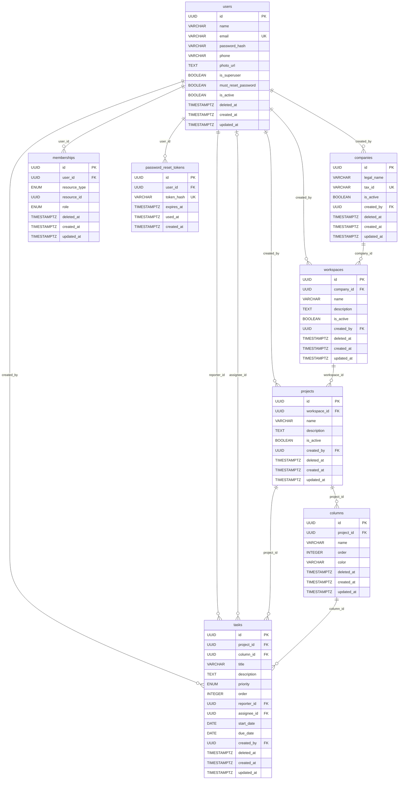

# Modelagem do Banco de Dados
**Sistema de Gestão de Projetos e Tasks**
Versão 1.0 — MVP | 20/02/2026

---

## 1. Visão Geral

Hierarquia de acesso em cascata: `Superusuário → Company → Workspace → Project → Task`.

Toda regra de permissão é resolvida pela tabela `memberships`, que relaciona usuários a recursos com papéis específicos, eliminando a necessidade de um campo `role` fixo no cadastro do usuário.

**Princípios adotados:**
- Soft delete via `deleted_at` em todas as entidades — nunca remoção física.
- Timestamps de auditoria automáticos: `created_at`, `updated_at` e `deleted_at`.
- Campo `created_by` em entidades de negócio para rastreabilidade.
- UUIDs como chave primária para evitar colisões e facilitar escala futura.
- ENUMs explícitos para campos de domínio fechado (`role`, `priority`, `resource_type`).
- Separação clara entre status de negócio (`is_active`) e exclusão lógica (`deleted_at`).

---

## 2. Enumerações (ENUMs)

### `membership_role`
| Valor | Descrição |
|---|---|
| `superuser` | Acesso irrestrito à plataforma inteira |
| `admin` | Administrador de uma empresa específica |
| `workspace_admin` | Administrador de um workspace específico |
| `member` | Colaborador comum, sem poderes administrativos |

### `resource_type`
| Valor | Descrição |
|---|---|
| `company` | O membership se refere a uma empresa |
| `workspace` | O membership se refere a um workspace |
| `project` | O membership se refere a um projeto |

### `task_priority`
| Valor | Descrição |
|---|---|
| `low` | Pode ser feita quando houver tempo |
| `medium` | Padrão — deve ser feita no ciclo atual |
| `high` | Precisa ser feita antes do fim do sprint |
| `urgent` | Bloqueia outras entregas, ação imediata |

---

## 3. Definição das Tabelas

### `users`
> Armazena todos os usuários da plataforma, independente de papel ou empresa.

| Coluna | Tipo | Restrições | Descrição |
|---|---|---|---|
| `id` | UUID | PK | Identificador único do usuário |
| `name` | VARCHAR(150) | NOT NULL | Nome completo |
| `email` | VARCHAR(255) | UK, NOT NULL | Email único, usado como login |
| `password_hash` | VARCHAR(255) | NOT NULL | Hash bcrypt da senha |
| `phone` | VARCHAR(30) | | Telefone opcional |
| `photo_url` | TEXT | | URL da foto de perfil |
| `is_superuser` | BOOLEAN | NOT NULL, DEFAULT false | Acesso irrestrito à plataforma |
| `must_reset_password` | BOOLEAN | NOT NULL, DEFAULT true | Força redefinição no próximo login |
| `is_active` | BOOLEAN | NOT NULL, DEFAULT true | false = login negado |
| `deleted_at` | TIMESTAMPTZ | | Soft delete |
| `created_at` | TIMESTAMPTZ | NOT NULL, DEFAULT now() | Criação automática |
| `updated_at` | TIMESTAMPTZ | NOT NULL, DEFAULT now() | Atualização automática |

---

### `companies`
> Representa as empresas clientes cadastradas pelo superusuário.

| Coluna | Tipo | Restrições | Descrição |
|---|---|---|---|
| `id` | UUID | PK | Identificador único da empresa |
| `legal_name` | VARCHAR(255) | NOT NULL | Razão social oficial |
| `tax_id` | VARCHAR(18) | UK, NOT NULL | CNPJ formatado, único no sistema |
| `is_active` | BOOLEAN | NOT NULL, DEFAULT true | false = todos os membros perdem acesso |
| `created_by` | UUID | FK → users.id, NOT NULL | Superusuário que criou |
| `deleted_at` | TIMESTAMPTZ | | Soft delete |
| `created_at` | TIMESTAMPTZ | NOT NULL, DEFAULT now() | Criação automática |
| `updated_at` | TIMESTAMPTZ | NOT NULL, DEFAULT now() | Atualização automática |

---

### `workspaces`
> Representa setores ou times dentro de uma empresa. Uma empresa pode ter múltiplos workspaces.

| Coluna | Tipo | Restrições | Descrição |
|---|---|---|---|
| `id` | UUID | PK | Identificador único do workspace |
| `company_id` | UUID | FK → companies.id, NOT NULL | Empresa à qual pertence |
| `name` | VARCHAR(150) | NOT NULL | Nome do workspace |
| `description` | TEXT | | Descrição opcional |
| `is_active` | BOOLEAN | NOT NULL, DEFAULT true | false = membros não conseguem acessar |
| `created_by` | UUID | FK → users.id, NOT NULL | Admin da empresa que criou |
| `deleted_at` | TIMESTAMPTZ | | Soft delete |
| `created_at` | TIMESTAMPTZ | NOT NULL, DEFAULT now() | Criação automática |
| `updated_at` | TIMESTAMPTZ | NOT NULL, DEFAULT now() | Atualização automática |

---

### `projects`
> Representa projetos dentro de um workspace. O Kanban é organizado por projeto.

| Coluna | Tipo | Restrições | Descrição |
|---|---|---|---|
| `id` | UUID | PK | Identificador único do projeto |
| `workspace_id` | UUID | FK → workspaces.id, NOT NULL | Workspace ao qual pertence |
| `name` | VARCHAR(150) | NOT NULL | Nome do projeto |
| `description` | TEXT | | Descrição opcional |
| `is_active` | BOOLEAN | NOT NULL, DEFAULT true | false = tasks não podem ser criadas/editadas |
| `created_by` | UUID | FK → users.id, NOT NULL | Quem criou o projeto |
| `deleted_at` | TIMESTAMPTZ | | Soft delete |
| `created_at` | TIMESTAMPTZ | NOT NULL, DEFAULT now() | Criação automática |
| `updated_at` | TIMESTAMPTZ | NOT NULL, DEFAULT now() | Atualização automática |

---

### `columns`
> Define as colunas do quadro Kanban de cada projeto. Criadas automaticamente ao criar um projeto.

| Coluna | Tipo | Restrições | Descrição |
|---|---|---|---|
| `id` | UUID | PK | Identificador único da coluna |
| `project_id` | UUID | FK → projects.id, NOT NULL | Projeto ao qual pertence |
| `name` | VARCHAR(100) | NOT NULL | Nome da coluna (ex: To Do) |
| `order` | INTEGER | NOT NULL | Posição no Kanban — espaçamento 1000, 2000... |
| `color` | VARCHAR(7) | | Cor em hex (#RRGGBB) |
| `deleted_at` | TIMESTAMPTZ | | Soft delete |
| `created_at` | TIMESTAMPTZ | NOT NULL, DEFAULT now() | Criação automática |
| `updated_at` | TIMESTAMPTZ | NOT NULL, DEFAULT now() | Atualização automática |

> **Nota:** Colunas padrão criadas automaticamente: `To Do` (1000), `In Progress` (2000), `Done` (3000). Deve haver sempre ao menos uma coluna ativa por projeto.

---

### `tasks`
> Unidade de trabalho do sistema. Vive dentro de uma coluna Kanban e pode ser atribuída a um membro.

| Coluna | Tipo | Restrições | Descrição |
|---|---|---|---|
| `id` | UUID | PK | Identificador único da task |
| `project_id` | UUID | FK → projects.id, NOT NULL | Projeto ao qual pertence |
| `column_id` | UUID | FK → columns.id, NOT NULL | Coluna atual no quadro |
| `title` | VARCHAR(255) | NOT NULL | Título da task |
| `description` | TEXT | | Detalhamento opcional (suporta markdown) |
| `priority` | ENUM | NOT NULL, DEFAULT medium | `task_priority` |
| `order` | INTEGER | NOT NULL | Posição dentro da coluna — espaçamento 1000, 2000... |
| `reporter_id` | UUID | FK → users.id, NOT NULL | Quem criou a task — imutável após criação |
| `assignee_id` | UUID | FK → users.id | Responsável atual — nullable, máximo 1 no MVP |
| `start_date` | DATE | | Data de início opcional |
| `due_date` | DATE | | Data de vencimento opcional — deve ser >= start_date |
| `created_by` | UUID | FK → users.id, NOT NULL | Usuário que criou o registro |
| `deleted_at` | TIMESTAMPTZ | | Soft delete |
| `created_at` | TIMESTAMPTZ | NOT NULL, DEFAULT now() | Criação automática |
| `updated_at` | TIMESTAMPTZ | NOT NULL, DEFAULT now() | Atualização automática |

> **Nota:** `CHECK (due_date >= start_date)` deve ser aplicado no banco quando ambas as datas estão preenchidas.

---

### `memberships`
> Tabela central de controle de acesso. Toda verificação de permissão passa por aqui.

| Coluna | Tipo | Restrições | Descrição |
|---|---|---|---|
| `id` | UUID | PK | Identificador único do vínculo |
| `user_id` | UUID | FK → users.id, NOT NULL | Usuário vinculado |
| `resource_type` | ENUM | NOT NULL | `resource_type` — company / workspace / project |
| `resource_id` | UUID | NOT NULL, IDX | ID do recurso referenciado |
| `role` | ENUM | NOT NULL | `membership_role` — papel no recurso |
| `deleted_at` | TIMESTAMPTZ | | Soft delete — membership inativo = sem acesso |
| `created_at` | TIMESTAMPTZ | NOT NULL, DEFAULT now() | Criação automática |
| `updated_at` | TIMESTAMPTZ | NOT NULL, DEFAULT now() | Atualização automática |

> **Nota:** `UNIQUE (user_id, resource_type, resource_id) WHERE deleted_at IS NULL` — índice único parcial para evitar duplicatas ativas sem impedir readição após remoção.

> **Nota:** `resource_id` usa UUID genérico sem FK tipada pois aponta para tabelas diferentes conforme `resource_type`. Integridade garantida pela aplicação.

---

### `password_reset_tokens`
> Tokens temporários para o fluxo de recuperação de senha via email.

| Coluna | Tipo | Restrições | Descrição |
|---|---|---|---|
| `id` | UUID | PK | Identificador único do token |
| `user_id` | UUID | FK → users.id, NOT NULL | Usuário que solicitou a recuperação |
| `token_hash` | VARCHAR(255) | UK, NOT NULL | Hash do token — nunca armazenar em plain text |
| `expires_at` | TIMESTAMPTZ | NOT NULL | Expiração — padrão: 2 horas após criação |
| `used_at` | TIMESTAMPTZ | | Preenchido ao usar — token de uso único |
| `created_at` | TIMESTAMPTZ | NOT NULL, DEFAULT now() | Criação automática |

> **Nota:** Token válido quando `used_at IS NULL AND expires_at > NOW()`.

---

## 4. Mapa de Relacionamentos

| Tabela Origem | Coluna | Tabela Destino | Coluna | Tipo | Comportamento |
|---|---|---|---|---|---|
| `companies` | `created_by` | `users` | `id` | N:1 | RESTRICT |
| `workspaces` | `company_id` | `companies` | `id` | N:1 | RESTRICT |
| `workspaces` | `created_by` | `users` | `id` | N:1 | RESTRICT |
| `projects` | `workspace_id` | `workspaces` | `id` | N:1 | RESTRICT |
| `projects` | `created_by` | `users` | `id` | N:1 | RESTRICT |
| `columns` | `project_id` | `projects` | `id` | N:1 | RESTRICT |
| `tasks` | `project_id` | `projects` | `id` | N:1 | RESTRICT |
| `tasks` | `column_id` | `columns` | `id` | N:1 | RESTRICT |
| `tasks` | `reporter_id` | `users` | `id` | N:1 | RESTRICT |
| `tasks` | `assignee_id` | `users` | `id` | N:1 | SET NULL |
| `tasks` | `created_by` | `users` | `id` | N:1 | RESTRICT |
| `memberships` | `user_id` | `users` | `id` | N:1 | RESTRICT |
| `password_reset_tokens` | `user_id` | `users` | `id` | N:1 | CASCADE |

---

## 5. Diagrama de Entidades (Mermaid)

---

## 6. Hierarquia de Acesso

| Papel | Escopo | Poderes principais |
|---|---|---|
| `superuser` | Plataforma inteira | CRUD em qualquer entidade. Cria empresas. Painel administrativo exclusivo. Nunca sujeito a regras de membership. |
| `admin` | Uma empresa | Cria e gerencia workspaces. Gerencia membros da empresa. Herda poderes de `workspace_admin` e `member` em todos os workspaces da empresa. |
| `workspace_admin` | Um workspace | Cria e gerencia projetos. Adiciona/remove membros. Gerencia colunas Kanban. Pode fazer soft delete de tasks. |
| `member` | Workspace ou projeto | Visualiza projetos. Cria, edita e move tasks. Pode excluir apenas as próprias tasks (reporter). |

---

## 7. Índices Recomendados

| Tabela / Colunas | Tipo | Justificativa |
|---|---|---|
| `users (email)` | UNIQUE | Login — query mais frequente do sistema |
| `users (deleted_at)` | BTREE | Filtrar usuários ativos |
| `companies (tax_id)` | UNIQUE | Validação de unicidade no cadastro |
| `workspaces (company_id)` | BTREE | Listar workspaces de uma empresa |
| `projects (workspace_id)` | BTREE | Listar projetos de um workspace |
| `columns (project_id, order)` | BTREE composto | Renderizar Kanban na ordem correta |
| `tasks (column_id, order)` | BTREE composto | Renderizar cards de uma coluna em ordem |
| `tasks (project_id, deleted_at)` | BTREE parcial | Listar tasks ativas de um projeto |
| `tasks (assignee_id)` | BTREE | Buscar tasks atribuídas a um usuário |
| `tasks (reporter_id)` | BTREE | Buscar tasks criadas por um usuário |
| `tasks (due_date)` | BTREE | Alertas de prazo |
| `memberships (user_id, resource_type, resource_id)` | BTREE composto | Verificação de permissão — executada em toda requisição |
| `memberships (resource_type, resource_id)` | BTREE composto | Listar membros de um recurso |
| `memberships (user_id, resource_type, resource_id) WHERE deleted_at IS NULL` | UNIQUE parcial | Evita duplicatas ativas no mesmo recurso |
| `password_reset_tokens (token_hash)` | UNIQUE | Lookup no fluxo de recuperação |
| `password_reset_tokens (user_id, used_at, expires_at)` | BTREE composto | Verificar tokens válidos de um usuário |
