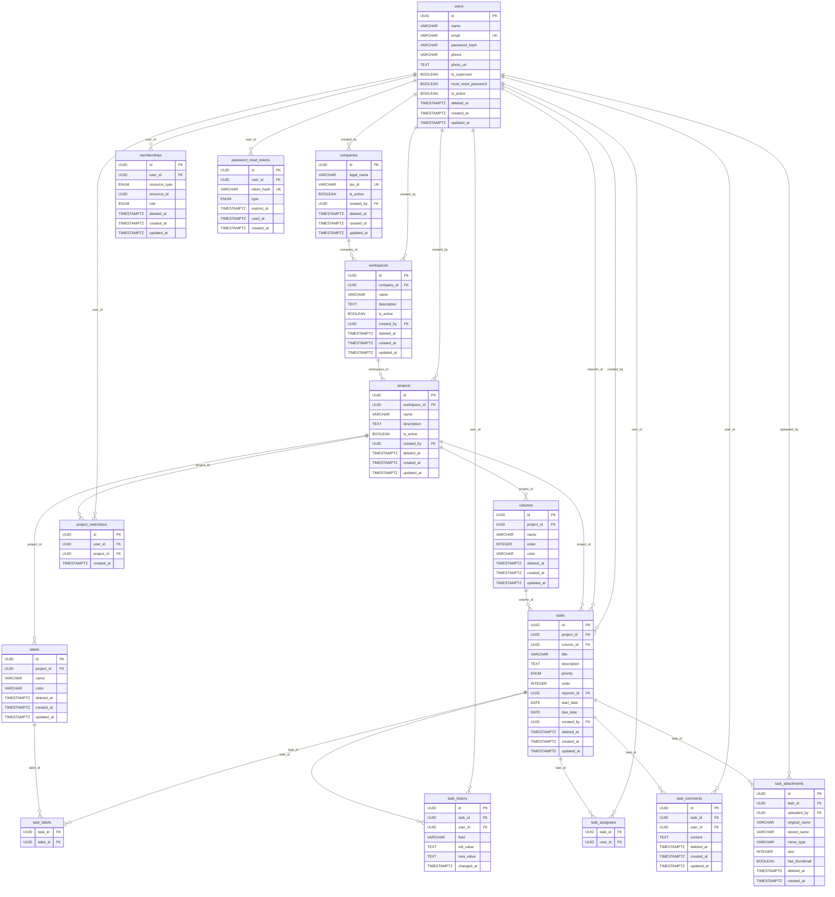

# Modelagem do Banco de Dados
**Sistema de Gestão de Projetos e Tasks**
Versão 2.0 — 17/03/2026

---

> **v2.0 — 17/03/2026:** Tabelas `task_assignees`, `labels`, `task_labels`, `task_history`, `task_comments`, `task_attachments`, `project_restrictions`, `notifications`, `notification_preferences` adicionadas; campo `assignee_id` removido de `tasks` (substituído por multi-assignee via `task_assignees`); ENUMs `token_type` e `notification_type` adicionados; `project_admin` adicionado ao `membership_role`.
> **v1.0 — 20/02/2026:** Versão inicial.

---

## 1. Visão Geral

Hierarquia de acesso em cascata: `Superusuário → Company → Workspace → Project → Task`.

Toda regra de permissão é resolvida pela tabela `memberships`, que relaciona usuários a recursos com papéis específicos, eliminando a necessidade de um campo `role` fixo no cadastro do usuário.

**Princípios adotados:**
- Soft delete via `deleted_at` em todas as entidades — nunca remoção física.
- Timestamps de auditoria automáticos: `created_at`, `updated_at` e `deleted_at`.
- Campo `created_by` em entidades de negócio para rastreabilidade.
- UUIDs como chave primária para evitar colisões e facilitar escala futura.
- ENUMs explícitos para campos de domínio fechado (`role`, `priority`, `resource_type`, `token_type`, `notification_type`).
- Separação clara entre status de negócio (`is_active`) e exclusão lógica (`deleted_at`).

---

## 2. Enumerações (ENUMs)

### `membership_role`
| Valor | Descrição |
|---|---|
| `superuser` | Acesso irrestrito à plataforma inteira |
| `admin` | Administrador de uma empresa específica |
| `workspace_admin` | Administrador de um workspace específico |
| `project_admin` | Administrador de um projeto específico (reservado para uso futuro) |
| `member` | Colaborador comum, sem poderes administrativos |

### `resource_type`
| Valor | Descrição |
|---|---|
| `company` | O membership se refere a uma empresa |
| `workspace` | O membership se refere a um workspace |
| `project` | O membership se refere a um projeto |

### `task_priority`
| Valor | Descrição |
|---|---|
| `low` | Pode ser feita quando houver tempo |
| `medium` | Padrão — deve ser feita no ciclo atual |
| `high` | Precisa ser feita antes do fim do sprint |
| `urgent` | Bloqueia outras entregas, ação imediata |

### `token_type`
| Valor | Descrição |
|---|---|
| `password_reset` | Token gerado no fluxo de recuperação de senha |
| `first_access` | Token gerado no convite de primeiro acesso ao sistema |

### `notification_type`
| Valor | Descrição |
|---|---|
| `ADMIN_BROADCAST` | Mensagem administrativa enviada a todos os usuários |
| `MENTION` | Usuário foi mencionado em um comentário ou descrição |
| `TASK_ASSIGNED` | Usuário foi atribuído como responsável de uma task |
| `TASK_COMMENT` | Novo comentário adicionado a uma task seguida |
| `TASK_UPDATED` | Alteração em uma task seguida pelo usuário |

---

## 3. Definição das Tabelas

### `users`
> Armazena todos os usuários da plataforma, independente de papel ou empresa.

| Coluna | Tipo | Restrições | Descrição |
|---|---|---|---|
| `id` | UUID | PK | Identificador único do usuário |
| `name` | VARCHAR(150) | NOT NULL | Nome completo |
| `email` | VARCHAR(255) | UK, NOT NULL | Email único, usado como login |
| `password_hash` | VARCHAR(255) | NOT NULL | Hash bcrypt da senha |
| `phone` | VARCHAR(30) | | Telefone opcional |
| `photo_url` | TEXT | | URL da foto de perfil |
| `is_superuser` | BOOLEAN | NOT NULL, DEFAULT false | Acesso irrestrito à plataforma |
| `must_reset_password` | BOOLEAN | NOT NULL, DEFAULT true | Força redefinição no próximo login |
| `is_active` | BOOLEAN | NOT NULL, DEFAULT true | false = login negado |
| `deleted_at` | TIMESTAMPTZ | | Soft delete |
| `created_at` | TIMESTAMPTZ | NOT NULL, DEFAULT now() | Criação automática |
| `updated_at` | TIMESTAMPTZ | NOT NULL, DEFAULT now() | Atualização automática |

---

### `companies`
> Representa as empresas clientes cadastradas pelo superusuário.

| Coluna | Tipo | Restrições | Descrição |
|---|---|---|---|
| `id` | UUID | PK | Identificador único da empresa |
| `legal_name` | VARCHAR(255) | NOT NULL | Razão social oficial |
| `tax_id` | VARCHAR(18) | UK, NOT NULL | CNPJ formatado, único no sistema |
| `is_active` | BOOLEAN | NOT NULL, DEFAULT true | false = todos os membros perdem acesso |
| `created_by` | UUID | FK → users.id, NOT NULL | Superusuário que criou |
| `deleted_at` | TIMESTAMPTZ | | Soft delete |
| `created_at` | TIMESTAMPTZ | NOT NULL, DEFAULT now() | Criação automática |
| `updated_at` | TIMESTAMPTZ | NOT NULL, DEFAULT now() | Atualização automática |

---

### `workspaces`
> Representa setores ou times dentro de uma empresa. Uma empresa pode ter múltiplos workspaces.

| Coluna | Tipo | Restrições | Descrição |
|---|---|---|---|
| `id` | UUID | PK | Identificador único do workspace |
| `company_id` | UUID | FK → companies.id, NOT NULL | Empresa à qual pertence |
| `name` | VARCHAR(150) | NOT NULL | Nome do workspace |
| `description` | TEXT | | Descrição opcional |
| `is_active` | BOOLEAN | NOT NULL, DEFAULT true | false = membros não conseguem acessar |
| `created_by` | UUID | FK → users.id, NOT NULL | Admin da empresa que criou |
| `deleted_at` | TIMESTAMPTZ | | Soft delete |
| `created_at` | TIMESTAMPTZ | NOT NULL, DEFAULT now() | Criação automática |
| `updated_at` | TIMESTAMPTZ | NOT NULL, DEFAULT now() | Atualização automática |

---

### `projects`
> Representa projetos dentro de um workspace. O Kanban é organizado por projeto.

| Coluna | Tipo | Restrições | Descrição |
|---|---|---|---|
| `id` | UUID | PK | Identificador único do projeto |
| `workspace_id` | UUID | FK → workspaces.id, NOT NULL | Workspace ao qual pertence |
| `name` | VARCHAR(150) | NOT NULL | Nome do projeto |
| `description` | TEXT | | Descrição opcional |
| `is_active` | BOOLEAN | NOT NULL, DEFAULT true | false = tasks não podem ser criadas/editadas |
| `created_by` | UUID | FK → users.id, NOT NULL | Quem criou o projeto |
| `deleted_at` | TIMESTAMPTZ | | Soft delete |
| `created_at` | TIMESTAMPTZ | NOT NULL, DEFAULT now() | Criação automática |
| `updated_at` | TIMESTAMPTZ | NOT NULL, DEFAULT now() | Atualização automática |

---

### `columns`
> Define as colunas do quadro Kanban de cada projeto. Criadas automaticamente ao criar um projeto.

| Coluna | Tipo | Restrições | Descrição |
|---|---|---|---|
| `id` | UUID | PK | Identificador único da coluna |
| `project_id` | UUID | FK → projects.id, NOT NULL | Projeto ao qual pertence |
| `name` | VARCHAR(100) | NOT NULL | Nome da coluna (ex: To Do) |
| `order` | INTEGER | NOT NULL | Posição no Kanban — espaçamento 1000, 2000... |
| `color` | VARCHAR(7) | | Cor em hex (#RRGGBB) |
| `deleted_at` | TIMESTAMPTZ | | Soft delete |
| `created_at` | TIMESTAMPTZ | NOT NULL, DEFAULT now() | Criação automática |
| `updated_at` | TIMESTAMPTZ | NOT NULL, DEFAULT now() | Atualização automática |

> **Nota:** Colunas padrão criadas automaticamente: `To Do` (1000), `In Progress` (2000), `Done` (3000). Deve haver sempre ao menos uma coluna ativa por projeto.

---

### `tasks`
> Unidade de trabalho do sistema. Vive dentro de uma coluna Kanban e pode ser atribuída a múltiplos membros.

| Coluna | Tipo | Restrições | Descrição |
|---|---|---|---|
| `id` | UUID | PK | Identificador único da task |
| `project_id` | UUID | FK → projects.id, NOT NULL | Projeto ao qual pertence |
| `column_id` | UUID | FK → columns.id, NOT NULL | Coluna atual no quadro |
| `title` | VARCHAR(255) | NOT NULL | Título da task |
| `description` | TEXT | | Detalhamento opcional (suporta markdown) |
| `priority` | ENUM | NOT NULL, DEFAULT medium | `task_priority` |
| `order` | INTEGER | NOT NULL | Posição dentro da coluna — espaçamento 1000, 2000... |
| `reporter_id` | UUID | FK → users.id, NOT NULL | Quem criou a task — imutável após criação |
| `start_date` | DATE | | Data de início opcional |
| `due_date` | DATE | | Data de vencimento opcional — deve ser >= start_date |
| `created_by` | UUID | FK → users.id, NOT NULL | Usuário que criou o registro |
| `deleted_at` | TIMESTAMPTZ | | Soft delete |
| `created_at` | TIMESTAMPTZ | NOT NULL, DEFAULT now() | Criação automática |
| `updated_at` | TIMESTAMPTZ | NOT NULL, DEFAULT now() | Atualização automática |

> **Nota:** `assignee_id` foi removido no v1.2. Responsáveis são gerenciados via tabela junction `task_assignees` para suporte a múltiplos responsáveis por task.

> **Nota:** `CHECK (due_date >= start_date)` deve ser aplicado no banco quando ambas as datas estão preenchidas.

---

### `labels`
> Etiquetas de classificação criadas por projeto. Permitem categorizar e filtrar tasks visualmente.

| Coluna | Tipo | Restrições | Descrição |
|---|---|---|---|
| `id` | UUID | PK | Identificador único da etiqueta |
| `project_id` | UUID | FK → projects.id, NOT NULL | Projeto ao qual pertence |
| `name` | VARCHAR(100) | NOT NULL | Nome da etiqueta |
| `color` | VARCHAR(7) | NOT NULL, DEFAULT '#6366f1' | Cor em hex (#RRGGBB) |
| `deleted_at` | TIMESTAMPTZ | | Soft delete |
| `created_at` | TIMESTAMPTZ | NOT NULL, DEFAULT now() | Criação automática |
| `updated_at` | TIMESTAMPTZ | NOT NULL, DEFAULT now() | Atualização automática |

> **Nota:** `UNIQUE (name, project_id)` — nome de etiqueta único dentro de cada projeto.

---

### `task_labels`
> Tabela junction N:N entre tasks e labels. Uma task pode ter múltiplas etiquetas.

| Coluna | Tipo | Restrições | Descrição |
|---|---|---|---|
| `task_id` | UUID | PK, FK → tasks.id, CASCADE | Task associada |
| `label_id` | UUID | PK, FK → labels.id, CASCADE | Etiqueta associada |

> **Nota:** Chave primária composta `(task_id, label_id)`. Remoção em cascata ao excluir task ou label.

---

### `task_assignees`
> Tabela junction N:N entre tasks e usuários. Suporta múltiplos responsáveis por task.

| Coluna | Tipo | Restrições | Descrição |
|---|---|---|---|
| `task_id` | UUID | PK, FK → tasks.id, CASCADE | Task associada |
| `user_id` | UUID | PK, FK → users.id | Responsável associado |

> **Nota:** Chave primária composta `(task_id, user_id)`. Remoção em cascata ao excluir a task.

---

### `memberships`
> Tabela central de controle de acesso. Toda verificação de permissão passa por aqui.

| Coluna | Tipo | Restrições | Descrição |
|---|---|---|---|
| `id` | UUID | PK | Identificador único do vínculo |
| `user_id` | UUID | FK → users.id, NOT NULL | Usuário vinculado |
| `resource_type` | ENUM | NOT NULL | `resource_type` — company / workspace / project |
| `resource_id` | UUID | NOT NULL, IDX | ID do recurso referenciado |
| `role` | ENUM | NOT NULL | `membership_role` — papel no recurso |
| `deleted_at` | TIMESTAMPTZ | | Soft delete — membership inativo = sem acesso |
| `created_at` | TIMESTAMPTZ | NOT NULL, DEFAULT now() | Criação automática |
| `updated_at` | TIMESTAMPTZ | NOT NULL, DEFAULT now() | Atualização automática |

> **Nota:** `UNIQUE (user_id, resource_type, resource_id) WHERE deleted_at IS NULL` — índice único parcial para evitar duplicatas ativas sem impedir readição após remoção.

> **Nota:** `resource_id` usa UUID genérico sem FK tipada pois aponta para tabelas diferentes conforme `resource_type`. Integridade garantida pela aplicação.

---

### `project_restrictions`
> Restrições de acesso a projetos específicos dentro de um workspace. Permite limitar a visibilidade de projetos para determinados membros.

| Coluna | Tipo | Restrições | Descrição |
|---|---|---|---|
| `id` | UUID | PK | Identificador único da restrição |
| `user_id` | UUID | FK → users.id, NOT NULL | Usuário restrito |
| `project_id` | UUID | FK → projects.id, NOT NULL | Projeto com acesso restrito |
| `created_at` | TIMESTAMPTZ | NOT NULL, DEFAULT now() | Criação automática |

> **Nota:** `UNIQUE (user_id, project_id)` — um usuário só pode ter uma restrição por projeto.

---

### `password_reset_tokens`
> Tokens temporários para os fluxos de recuperação de senha e primeiro acesso via email.

| Coluna | Tipo | Restrições | Descrição |
|---|---|---|---|
| `id` | UUID | PK | Identificador único do token |
| `user_id` | UUID | FK → users.id CASCADE, NOT NULL | Usuário que solicitou o token |
| `token_hash` | VARCHAR(255) | UK, NOT NULL | Hash SHA-256 do token — nunca armazenar em plain text |
| `type` | ENUM | NOT NULL, DEFAULT password_reset | `token_type` — password_reset / first_access |
| `expires_at` | TIMESTAMPTZ | NOT NULL | Expiração — padrão: 2 horas após criação |
| `used_at` | TIMESTAMPTZ | | Preenchido ao usar — token de uso único |
| `created_at` | TIMESTAMPTZ | NOT NULL, DEFAULT now() | Criação automática |

> **Nota:** Token válido quando `used_at IS NULL AND expires_at > NOW()`.

---

### `task_history`
> Registro imutável de alterações em tasks. Auditoria completa de mudanças campo a campo.

| Coluna | Tipo | Restrições | Descrição |
|---|---|---|---|
| `id` | UUID | PK | Identificador único do registro |
| `task_id` | UUID | FK → tasks.id CASCADE, NOT NULL | Task alterada |
| `user_id` | UUID | FK → users.id CASCADE, NOT NULL | Usuário que realizou a alteração |
| `field` | VARCHAR(100) | NOT NULL | Nome do campo alterado |
| `old_value` | TEXT | | Valor anterior (nullable) |
| `new_value` | TEXT | | Novo valor (nullable) |
| `changed_at` | TIMESTAMPTZ | NOT NULL, DEFAULT now() | Momento da alteração |

> **Nota:** Registros de histórico não possuem soft delete — são imutáveis por design. Remoção em cascata ao excluir a task.

---

### `task_comments`
> Comentários associados a tasks. Suporta soft delete para preservar threads de discussão.

| Coluna | Tipo | Restrições | Descrição |
|---|---|---|---|
| `id` | UUID | PK | Identificador único do comentário |
| `task_id` | UUID | FK → tasks.id CASCADE, NOT NULL | Task comentada |
| `user_id` | UUID | FK → users.id CASCADE, NOT NULL | Autor do comentário |
| `content` | TEXT | NOT NULL | Conteúdo do comentário (suporta markdown) |
| `deleted_at` | TIMESTAMPTZ | | Soft delete |
| `created_at` | TIMESTAMPTZ | NOT NULL, DEFAULT now() | Criação automática |
| `updated_at` | TIMESTAMPTZ | NOT NULL, DEFAULT now() | Atualização automática |

---

### `task_attachments`
> Arquivos anexados a tasks. Metadados de armazenamento — o arquivo em si é gerenciado externamente (ex: S3).

| Coluna | Tipo | Restrições | Descrição |
|---|---|---|---|
| `id` | UUID | PK | Identificador único do anexo |
| `task_id` | UUID | FK → tasks.id CASCADE, NOT NULL | Task à qual pertence |
| `uploaded_by` | UUID | FK → users.id, NOT NULL | Usuário que fez o upload |
| `original_name` | VARCHAR(255) | NOT NULL | Nome original do arquivo |
| `stored_name` | VARCHAR(255) | NOT NULL | Nome no armazenamento (ex: UUID + extensão) |
| `mime_type` | VARCHAR(127) | NOT NULL | Tipo MIME do arquivo |
| `size` | INTEGER | NOT NULL | Tamanho em bytes |
| `has_thumbnail` | BOOLEAN | NOT NULL, DEFAULT false | Indica se miniatura foi gerada |
| `deleted_at` | TIMESTAMPTZ | | Soft delete |
| `created_at` | TIMESTAMPTZ | NOT NULL, DEFAULT now() | Criação automática |

---

### `notifications`
> Notificações enviadas a usuários por eventos do sistema.

| Coluna | Tipo | Restrições | Descrição |
|---|---|---|---|
| `id` | UUID | PK | Identificador único da notificação |
| `recipient_id` | UUID | FK → users.id, NOT NULL | Usuário destinatário |
| `type` | ENUM | NOT NULL | `notification_type` — tipo do evento |
| `title` | VARCHAR(255) | NOT NULL | Título da notificação |
| `body` | TEXT | NOT NULL | Corpo da mensagem |
| `is_read` | BOOLEAN | NOT NULL, DEFAULT false | Indica se foi lida |
| `read_at` | TIMESTAMPTZ | | Momento da leitura |
| `task_id` | UUID | FK → tasks.id SET NULL | Task relacionada (opcional) |
| `project_id` | UUID | FK → projects.id SET NULL | Projeto relacionado (opcional) |
| `actor_id` | UUID | FK → users.id | Usuário que originou o evento (opcional) |
| `metadata` | JSON | | Dados adicionais do evento em formato livre |
| `deleted_at` | TIMESTAMPTZ | | Soft delete |
| `created_at` | TIMESTAMPTZ | NOT NULL, DEFAULT now() | Criação automática |

---

### `notification_preferences`
> Preferências de notificação por usuário. Um registro por usuário, criado no primeiro acesso.

| Coluna | Tipo | Restrições | Descrição |
|---|---|---|---|
| `id` | UUID | PK | Identificador único do registro |
| `user_id` | UUID | UK, FK → users.id CASCADE, NOT NULL | Usuário dono das preferências |
| `admin_broadcast` | BOOLEAN | NOT NULL, DEFAULT true | Receber notificações administrativas |
| `mention` | BOOLEAN | NOT NULL, DEFAULT true | Receber notificações de menções |
| `task_assigned` | BOOLEAN | NOT NULL, DEFAULT true | Receber notificações de atribuição |
| `task_comment` | BOOLEAN | NOT NULL, DEFAULT true | Receber notificações de comentários |
| `task_updated` | BOOLEAN | NOT NULL, DEFAULT true | Receber notificações de alterações em tasks |
| `updated_at` | TIMESTAMPTZ | NOT NULL, DEFAULT now() | Atualização automática |

> **Nota:** `UNIQUE (user_id)` — exatamente um registro de preferências por usuário.

---

## 4. Mapa de Relacionamentos

| Tabela Origem | Coluna | Tabela Destino | Coluna | Tipo | Comportamento |
|---|---|---|---|---|---|
| `companies` | `created_by` | `users` | `id` | N:1 | RESTRICT |
| `workspaces` | `company_id` | `companies` | `id` | N:1 | RESTRICT |
| `workspaces` | `created_by` | `users` | `id` | N:1 | RESTRICT |
| `projects` | `workspace_id` | `workspaces` | `id` | N:1 | RESTRICT |
| `projects` | `created_by` | `users` | `id` | N:1 | RESTRICT |
| `columns` | `project_id` | `projects` | `id` | N:1 | RESTRICT |
| `tasks` | `project_id` | `projects` | `id` | N:1 | RESTRICT |
| `tasks` | `column_id` | `columns` | `id` | N:1 | RESTRICT |
| `tasks` | `reporter_id` | `users` | `id` | N:1 | RESTRICT |
| `tasks` | `created_by` | `users` | `id` | N:1 | RESTRICT |
| `labels` | `project_id` | `projects` | `id` | N:1 | RESTRICT |
| `task_labels` | `task_id` | `tasks` | `id` | N:M | CASCADE |
| `task_labels` | `label_id` | `labels` | `id` | N:M | CASCADE |
| `task_assignees` | `task_id` | `tasks` | `id` | N:M | CASCADE |
| `task_assignees` | `user_id` | `users` | `id` | N:M | RESTRICT |
| `memberships` | `user_id` | `users` | `id` | N:1 | RESTRICT |
| `project_restrictions` | `user_id` | `users` | `id` | N:1 | RESTRICT |
| `project_restrictions` | `project_id` | `projects` | `id` | N:1 | RESTRICT |
| `password_reset_tokens` | `user_id` | `users` | `id` | N:1 | CASCADE |
| `task_history` | `task_id` | `tasks` | `id` | N:1 | CASCADE |
| `task_history` | `user_id` | `users` | `id` | N:1 | CASCADE |
| `task_comments` | `task_id` | `tasks` | `id` | N:1 | CASCADE |
| `task_comments` | `user_id` | `users` | `id` | N:1 | CASCADE |
| `task_attachments` | `task_id` | `tasks` | `id` | N:1 | CASCADE |
| `task_attachments` | `uploaded_by` | `users` | `id` | N:1 | RESTRICT |
| `notifications` | `recipient_id` | `users` | `id` | N:1 | RESTRICT |
| `notifications` | `task_id` | `tasks` | `id` | N:1 | SET NULL |
| `notifications` | `project_id` | `projects` | `id` | N:1 | SET NULL |
| `notifications` | `actor_id` | `users` | `id` | N:1 | SET NULL |
| `notification_preferences` | `user_id` | `users` | `id` | 1:1 | CASCADE |

---

## 5. Diagrama de Entidades (Mermaid)

```mermaid
erDiagram
    users {
        UUID id PK
        VARCHAR name
        VARCHAR email UK
        VARCHAR password_hash
        VARCHAR phone
        TEXT photo_url
        BOOLEAN is_superuser
        BOOLEAN must_reset_password
        BOOLEAN is_active
        TIMESTAMPTZ deleted_at
        TIMESTAMPTZ created_at
        TIMESTAMPTZ updated_at
    }

    companies {
        UUID id PK
        VARCHAR legal_name
        VARCHAR tax_id UK
        BOOLEAN is_active
        UUID created_by FK
        TIMESTAMPTZ deleted_at
        TIMESTAMPTZ created_at
        TIMESTAMPTZ updated_at
    }

    workspaces {
        UUID id PK
        UUID company_id FK
        VARCHAR name
        TEXT description
        BOOLEAN is_active
        UUID created_by FK
        TIMESTAMPTZ deleted_at
        TIMESTAMPTZ created_at
        TIMESTAMPTZ updated_at
    }

    projects {
        UUID id PK
        UUID workspace_id FK
        VARCHAR name
        TEXT description
        BOOLEAN is_active
        UUID created_by FK
        TIMESTAMPTZ deleted_at
        TIMESTAMPTZ created_at
        TIMESTAMPTZ updated_at
    }

    columns {
        UUID id PK
        UUID project_id FK
        VARCHAR name
        INTEGER order
        VARCHAR color
        TIMESTAMPTZ deleted_at
        TIMESTAMPTZ created_at
        TIMESTAMPTZ updated_at
    }

    tasks {
        UUID id PK
        UUID project_id FK
        UUID column_id FK
        VARCHAR title
        TEXT description
        ENUM priority
        INTEGER order
        UUID reporter_id FK
        DATE start_date
        DATE due_date
        UUID created_by FK
        TIMESTAMPTZ deleted_at
        TIMESTAMPTZ created_at
        TIMESTAMPTZ updated_at
    }

    labels {
        UUID id PK
        UUID project_id FK
        VARCHAR name
        VARCHAR color
        TIMESTAMPTZ deleted_at
        TIMESTAMPTZ created_at
        TIMESTAMPTZ updated_at
    }

    task_labels {
        UUID task_id FK
        UUID label_id FK
    }

    task_assignees {
        UUID task_id FK
        UUID user_id FK
    }

    memberships {
        UUID id PK
        UUID user_id FK
        ENUM resource_type
        UUID resource_id
        ENUM role
        TIMESTAMPTZ deleted_at
        TIMESTAMPTZ created_at
        TIMESTAMPTZ updated_at
    }

    project_restrictions {
        UUID id PK
        UUID user_id FK
        UUID project_id FK
        TIMESTAMPTZ created_at
    }

    password_reset_tokens {
        UUID id PK
        UUID user_id FK
        VARCHAR token_hash UK
        ENUM type
        TIMESTAMPTZ expires_at
        TIMESTAMPTZ used_at
        TIMESTAMPTZ created_at
    }

    task_history {
        UUID id PK
        UUID task_id FK
        UUID user_id FK
        VARCHAR field
        TEXT old_value
        TEXT new_value
        TIMESTAMPTZ changed_at
    }

    task_comments {
        UUID id PK
        UUID task_id FK
        UUID user_id FK
        TEXT content
        TIMESTAMPTZ deleted_at
        TIMESTAMPTZ created_at
        TIMESTAMPTZ updated_at
    }

    task_attachments {
        UUID id PK
        UUID task_id FK
        UUID uploaded_by FK
        VARCHAR original_name
        VARCHAR stored_name
        VARCHAR mime_type
        INTEGER size
        BOOLEAN has_thumbnail
        TIMESTAMPTZ deleted_at
        TIMESTAMPTZ created_at
    }

    users ||--o{ companies : "created_by"
    users ||--o{ workspaces : "created_by"
    users ||--o{ projects : "created_by"
    users ||--o{ tasks : "created_by"
    users ||--o{ tasks : "reporter_id"
    users ||--o{ memberships : "user_id"
    users ||--o{ password_reset_tokens : "user_id"
    users ||--o{ task_history : "user_id"
    users ||--o{ task_comments : "user_id"
    users ||--o{ task_attachments : "uploaded_by"
    users ||--o{ project_restrictions : "user_id"
    users ||--o{ task_assignees : "user_id"
    companies ||--o{ workspaces : "company_id"
    workspaces ||--o{ projects : "workspace_id"
    projects ||--o{ columns : "project_id"
    projects ||--o{ tasks : "project_id"
    projects ||--o{ labels : "project_id"
    projects ||--o{ project_restrictions : "project_id"
    columns ||--o{ tasks : "column_id"
    tasks ||--o{ task_labels : "task_id"
    tasks ||--o{ task_assignees : "task_id"
    tasks ||--o{ task_history : "task_id"
    tasks ||--o{ task_comments : "task_id"
    tasks ||--o{ task_attachments : "task_id"
    labels ||--o{ task_labels : "label_id"
```

---

## 6. Hierarquia de Acesso

| Papel | Escopo | Poderes principais |
|---|---|---|
| `superuser` | Plataforma inteira | CRUD em qualquer entidade. Cria empresas. Painel administrativo exclusivo. Nunca sujeito a regras de membership. |
| `admin` | Uma empresa | Cria e gerencia workspaces. Gerencia membros da empresa. Herda poderes de `workspace_admin` e `member` em todos os workspaces da empresa. |
| `workspace_admin` | Um workspace | Cria e gerencia projetos. Adiciona/remove membros. Gerencia colunas Kanban. Pode fazer soft delete de tasks. |
| `project_admin` | Um projeto | Administrador de um projeto específico. Papel reservado para granularidade futura de permissões por projeto. |
| `member` | Workspace ou projeto | Visualiza projetos. Cria, edita e move tasks. Pode excluir apenas as próprias tasks (reporter). |

---

## 7. Índices Recomendados

| Tabela / Colunas | Tipo | Justificativa |
|---|---|---|
| `users (email)` | UNIQUE | Login — query mais frequente do sistema |
| `users (deleted_at)` | BTREE | Filtrar usuários ativos |
| `companies (tax_id)` | UNIQUE | Validação de unicidade no cadastro |
| `workspaces (company_id)` | BTREE | Listar workspaces de uma empresa |
| `projects (workspace_id)` | BTREE | Listar projetos de um workspace |
| `columns (project_id, order)` | BTREE composto | Renderizar Kanban na ordem correta |
| `tasks (column_id, order)` | BTREE composto | Renderizar cards de uma coluna em ordem |
| `tasks (project_id, deleted_at)` | BTREE parcial | Listar tasks ativas de um projeto |
| `tasks (reporter_id)` | BTREE | Buscar tasks criadas por um usuário |
| `tasks (due_date)` | BTREE | Alertas de prazo |
| `labels (project_id)` | BTREE | Listar etiquetas de um projeto |
| `labels (name, project_id)` | UNIQUE | Unicidade de nome de etiqueta por projeto |
| `task_assignees (task_id, user_id)` | UNIQUE (PK) | Chave primária da junction |
| `task_labels (task_id, label_id)` | UNIQUE (PK) | Chave primária da junction |
| `memberships (user_id, resource_type, resource_id)` | BTREE composto | Verificação de permissão — executada em toda requisição |
| `memberships (resource_type, resource_id)` | BTREE composto | Listar membros de um recurso |
| `memberships (user_id, resource_type, resource_id) WHERE deleted_at IS NULL` | UNIQUE parcial | Evita duplicatas ativas no mesmo recurso |
| `project_restrictions (user_id, project_id)` | UNIQUE | Unicidade de restrição por usuário/projeto |
| `project_restrictions (user_id)` | BTREE | Buscar restrições de um usuário |
| `project_restrictions (project_id)` | BTREE | Buscar restrições de um projeto |
| `password_reset_tokens (token_hash)` | UNIQUE | Lookup no fluxo de recuperação/primeiro acesso |
| `password_reset_tokens (user_id, type, used_at, expires_at)` | BTREE composto | Verificar tokens válidos de um usuário por tipo |
| `task_history (task_id)` | BTREE | Buscar histórico de uma task |
| `task_history (changed_at)` | BTREE | Ordenação cronológica do histórico |
| `task_comments (task_id, deleted_at)` | BTREE composto | Listar comentários ativos de uma task |
| `task_attachments (task_id, deleted_at)` | BTREE composto | Listar anexos ativos de uma task |
| `notifications (recipient_id, is_read, created_at)` | BTREE composto | Listar notificações não lidas de um usuário |
| `notifications (recipient_id, created_at)` | BTREE composto | Listar todas as notificações de um usuário por data |
| `notification_preferences (user_id)` | UNIQUE | Um registro de preferências por usuário |
